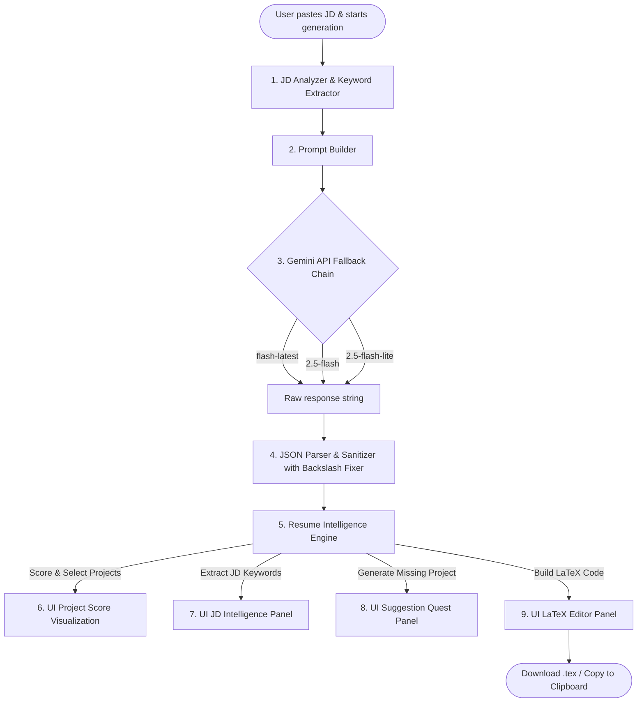

# ⚡ ResumeForge AI — Mission Control v3.0

<p align="center">
  
  
  
  
  
  
  
  
</p>

---

## 1. Elevator Pitch

**ResumeForge AI** is an advanced client-side web application designed to help AI/ML engineering candidates dynamically adapt their resume to target job descriptions (JDs) with maximum precision. By leveraging Google's Gemini API, the app acts as an experienced tech recruiter to score your projects, rank your skills, and generate missing JD-specific portfolio components. It constructs a complete, compilable, and hyperlinked one-page LaTeX resume formatted using the industry-favorite Jake Ryan template. This zero-dependency, lightweight client-side application guarantees total data privacy by processing all requests directly in your browser.

---

## 2. Feature Cards

###  JD Intelligence
Extracts languages, frameworks, AI/ML concepts, DevOps requirements, and responsibilities directly from the target job description.

###  Dynamic Project Selection & Scoring
Scores your projects out of 100 based on Technology Match (40%), Keyword Match (25%), Domain Match (20%), and Business Impact (15%).

###  Production-Ready Project Generation
Identifies gaps between your portfolio and the JD, generating a production-quality project to replace the weakest match and inserting it directly into the LaTeX code.

###  Clickable LaTeX Links
Replaces plain text contact headers and project links with clickable mailto:, tel:, LinkedIn, and GitHub links via the `hyperref` and `fontawesome5` LaTeX packages.

###  One-Page Guarantee
Automatically validates layout constraints, font configurations, and vertical spacing to ensure the compiled document fits on exactly one page.

### Model Fallback Chain
Robust client-side pipeline that automatically cycles through active Google Gemini models with exponential backoff on quota limits.

---

## 3. Why ResumeForge AI?

| Feature / Goal | Traditional Resume Builders | ResumeForge AI |
|:---|:---:|:---:|
| **Tailored to Job Description** | Manual copying/pasting | Dynamic and automated AI rewriting |
| **Recruiter Decision Logic** | None (static format) | Dynamic project scoring and replacement |
| **Portfolio Gap-Filling** | Manually writing new items | Automated generation of a targeted project |
| **LaTeX Support** | None or buggy export | Native Jake Ryan LaTeX compiler-ready output |
| **Hyperlinked Fields** | Text only | Integrated clickable hyperref tags |
| **Privacy Safeguards** | Uploads to third-party databases | 100% Client-side. Stored in LocalStorage |

---

## 4. Architecture Diagram



---

## 5. AI Pipeline Visualization

```mermaid
gantt
    title AI 10-Stage Pipeline
    dateFormat  X
    axisFormat %s
    
    stage1 :active, 0, 1
    stage2 :active, 1, 2
    stage3 :active, 2, 3
    stage4 :active, 3, 4
    stage5 :active, 4, 5
    stage6 :active, 5, 6
    stage7 :active, 6, 7
    stage8 :active, 7, 8
    stage9 :active, 8, 9
    stage10 :active, 9, 10
    
    section Pipeline Stages
    1. JD Analysis           :stage1, 0, 1
    2. Project Scoring        :stage2, 1, 2
    3. Project Selection      :stage3, 2, 3
    4. Project Generation     :stage4, 3, 4
    5. Project Insertion      :stage5, 4, 5
    6. Skills Filtering       :stage6, 5, 6
    7. Certification Ranking  :stage7, 6, 7
    8. Experience Rewriting   :stage8, 7, 8
    9. Hyperlinked Header     :stage9, 8, 9
    10. ATS Validation        :stage10, 9, 10
```



---

## 6. Repository Structure

```
resume-generator/
├── .github/
│   ├── ISSUE_TEMPLATE/
│   │   ├── bug_report.md       # Bug reporting template
│   │   └── feature_request.md  # Feature request template
│   └── PULL_REQUEST_TEMPLATE.md # PR description guidelines
├── CHANGELOG.md                 # Semantic versioning release log
├── CODE_OF_CONDUCT.md           # Contributor behavior standards
├── CONTRIBUTING.md              # Developers and designers guide
├── LICENSE                      # Open-source MIT License
├── SECURITY.md                  # Security policies and key safety rules
├── CONTEXT.md                   # Full AI model instructions & metadata
├── index.html                   # Cyberpunk Mission Control UI panel
├── index.css                    # Zero-dependency HUD styling layout
├── app.js                       # Decoupled AI pipeline & UI controller
└── read_excel.ps1               # Utility data import tool
```

---

## 7. Tech Stack

- **Frontend Core**: Vanilla HTML5, CSS3 Custom Properties (Glow, radial nebulas, polygon clip paths)
- **Application Logic**: Vanilla ES6+ Javascript
- **Generative AI Core**: Google Gemini Generative API (v1betaREST API)
- **Formatting Engines**: LaTeX (Jake Ryan format) via FontAwesome5 and Hyperref packages
- **Data Persistence**: Client-side HTML5 LocalStorage

---

## 8. Installation

### Prerequisites
- A modern web browser (Chrome, Edge, Firefox, or Safari).
- A Google Gemini API key. You can get a free key at [Google AI Studio](https://aistudio.google.com/app/apikey).

### Steps
1. **Clone the Repository**:
   ```bash
   git clone https://github.com/Ma-nas/ResumeForge-AI.git
   cd ResumeForge-AI
   ```
2. **Launch the Application**:
   Open `index.html` in your web browser (you can double-click the file or use a local server extension like Live Server in VS Code).
3. **Configure the Key**:
   Paste your Gemini API key in the configuration modal that pops up on the first run.
4. **Run First Tailor Job**:
   Paste any job description and click **Execute Mission** (or press `Ctrl+Enter`).

---

## 9. Usage Guide

1. **Mission Brief**: Paste the Job Description into the textarea. The status bar displays real-time character count.
2. **Execute Mission**: Click the execute button. The system status blinks, and the engine starts scanning model fallbacks.
3. **Power Level**: View your ATS score alongside instant feedback comments.
4. **JD Intelligence & Matching Panels**: Analyze extracted role requirements, key technologies, missing domain gaps, and detailed project matching scores.
5. **LaTeX Output Payload**: Inspect the generated LaTeX source. Click **EXTRACT** to copy code to the clipboard, or **DOWNLOAD .TEX** to download the compilable `.tex` file.
6. **New Quest Unlocked**: Read the detailed outline of the generated project that was inserted into the resume.

---

## 10. Prompt Engineering & JSON Schema

ResumeForge AI uses a deterministic system prompt to guide Gemini's outputs. The prompt instructs the model to score projects, write clickable LaTeX macros, reorder categories, and write bullet points following the formula:
`[Action Verb] + [Technology used] + [Business Impact] + [Metric if possible]`

### JSON Response Schema
```json
{
  "ats_score": 95,
  "ats_feedback": "Resume formatted to match the target ML Engineer role.",
  "jd_analysis": {
    "target_role": "Machine Learning Engineer",
    "required_technologies": ["PyTorch", "Python"],
    "preferred_technologies": ["Docker", "Kubernetes"],
    "key_responsibilities": ["Train neural nets", "Deploy RAG models"],
    "missing_skills": ["Kubernetes", "MLOps"]
  },
  "selected_projects": [
    {
      "name": "EvalForge",
      "score": 95,
      "reason": "Directly matches PyTorch and LLM evaluation criteria.",
      "generated": false
    },
    {
      "name": "Generated Project Title",
      "score": 100,
      "reason": "Fills the MLOps deployment gap by building a pipeline.",
      "generated": true,
      "fills_gap": "MLOps & Docker",
      "description": "Short project summary.",
      "tech_stack": ["Docker", "Kubernetes", "Python"],
      "why": "Demonstrates containerization skills."
    }
  ],
  "replaced_project": {
    "name": "WanderChat",
    "score": 45,
    "reason": "Lowest technology match for this specific job."
  },
  "skills_emphasized": ["Python", "PyTorch", "FastAPI"],
  "certifications_used": ["NVIDIA Deep Learning", "NLP Specialization"],
  "latex": "%% Complete, compilable LaTeX code here..."
}
```

---

## 11. Roadmap

- **v1.0.0**: Basic HTML/JS layout + Gemini client-side calls.
- **v2.0.0**: Cyberpunk gaming HUD theme + fallback model chain + API key configuration.
- **v3.0.0 (Current)**: JD analysis panels + dynamic scoring logic + generated project in LaTeX + clickable links.
- **v4.0.0 (Planned)**: Client-side LaTeX-to-PDF compilation + multiple resume layout templates + OpenAI/Anthropic/Local Ollama model fallbacks.

---

## 12. Performance Goals

- **One-page constraint validation**: Spacers and margins are scaled dynamically.
- **Generation speed**: `< 20 seconds` average response time.
- **ATS Compliant Score**: Target `> 90` score.

---

## 13. License

Distributed under the MIT License. See [LICENSE](LICENSE) for more information.
